# Diagram Generation Prompts for ATTS Architecture

Use these prompts with Nanobanana, Midjourney, DALL-E, or similar AI image generators.
For technical diagrams, tools like Excalidraw, Mermaid, or draw.io may produce cleaner results.

---

## PROMPT 1: ATTS Main Workflow Diagram

### For AI Image Generators (Nanobanana/Midjourney/DALL-E):

```
Create a clean, professional flowchart diagram for an AI system architecture called "Adaptive Test-Time Scaling (ATTS)".

The flow should show:
1. INPUT: "Problem P" (rectangle on left)
2. First stage: "Difficulty Estimator" (rounded rectangle) that outputs d ∈ [0,1]
3. Decision diamond: "d < 0.3?" 
4. Three branches:
   - YES → "Direct Mode" (green box, ~500 tokens)
   - NO → Another diamond "d < 0.7?"
     - YES → "Thinking Mode" (yellow box, ~8K tokens)
     - NO → "Deep Mode" (red box, ~25K tokens)
5. All modes flow to: "Solution Generated"
6. Then: "Self-Verification" (circle)
7. Decision: "Confidence > τ?"
   - YES → "Output Final Answer"
   - NO → Loop back with "Escalate to next mode" (only if not already in Deep)

Style: Clean, technical, light background, modern tech diagram aesthetic, no gradients, flat design, suitable for academic paper. Use blue/green/yellow/red color coding for the three modes.
```

### For Mermaid (Code-based, cleaner result):

```mermaid
flowchart TD
    A[Problem P] --> B{Difficulty Estimator}
    B -->|d < 0.3| C[🟢 Direct Mode<br/>~500 tokens]
    B -->|0.3 ≤ d < 0.7| D[🟡 Thinking Mode<br/>~8K tokens]
    B -->|d ≥ 0.7| E[🔴 Deep Mode<br/>~25K tokens]
    
    C --> F[Solution]
    D --> F
    E --> F
    
    F --> G{Self-Verification<br/>Score}
    G -->|Score ≥ τ| H[✅ Output Answer]
    G -->|Score < τ<br/>& not Deep| I[⬆️ Escalate]
    I --> D
    I --> E
    G -->|Score < τ<br/>& Deep| H
    
    style C fill:#90EE90
    style D fill:#FFEB3B
    style E fill:#FF6B6B
    style H fill:#4CAF50,color:#fff
```



---

## PROMPT 2: Mode Comparison Visualization

### For AI Image Generators:

```
Create a horizontal comparison infographic showing three AI reasoning modes:

LEFT section (Green): "Direct Mode"
- Icon: Lightning bolt
- Label: "d < 0.3 (Easy)"
- Tokens: ~500
- Speed: Fast
- Simple problem example shown

MIDDLE section (Yellow): "Thinking Mode"  
- Icon: Brain with gears
- Label: "0.3 ≤ d < 0.7 (Medium)"
- Tokens: ~8,000
- Speed: Moderate
- Medium problem example shown

RIGHT section (Red): "Deep Mode"
- Icon: Brain with many connections
- Label: "d ≥ 0.7 (Hard)"
- Tokens: ~25,000
- Speed: Thorough
- Complex problem example shown

Style: Clean infographic style, white background, modern flat icons, consistent spacing, suitable for slides or social media. Include a gradient arrow at bottom showing "Compute Cost →"
```

### For Excalidraw/Draw.io Description:

Create three equal-width columns:
- Column 1: Green header "DIRECT", lightning icon, "d < 0.3", "~500 tokens", "Single-pass answer"
- Column 2: Yellow header "THINKING", brain icon, "0.3 ≤ d < 0.7", "~8K tokens", "Step-by-step reasoning"
- Column 3: Red header "DEEP", complex brain icon, "d ≥ 0.7", "~25K tokens", "Full iterative refinement"
- Bottom: Arrow labeled "Computational Cost" pointing right

---

## PROMPT 3: Unified Self-Verification Architecture (USVA)

### For AI Image Generators:

```
Create a technical diagram showing a "Unified Self-Verification Architecture" for AI reasoning.

Center: Large circle labeled "Unified Model" 

Four quadrants/aspects around it:
1. TOP-LEFT (Blue): "Logical Coherence (LC)" - Icon: Chain links - "Step-to-step validity"
2. TOP-RIGHT (Green): "Factual Correctness (FC)" - Icon: Checkmark - "Accuracy of facts"
3. BOTTOM-LEFT (Orange): "Completeness (CM)" - Icon: Puzzle pieces - "All aspects addressed"
4. BOTTOM-RIGHT (Purple): "Goal Alignment (GA)" - Icon: Target - "Solves the right problem"

Arrows flowing from all four into center "Unified Model"
Output arrow from center: "Verified Solution + Confidence Score"

Below: Three connected boxes showing "Math", "Code", "Agents" all using the same verification

Style: Professional technical diagram, suitable for academic paper, clean lines, subtle color coding, white background.
```

---

## PROMPT 4: Escalation Mechanism Detail

### For AI Image Generators:

```
Create a diagram showing the "Uncertainty-Triggered Escalation" safety mechanism:

START: Problem enters system
↓
Box 1: "Attempt in Current Mode" (show mode label)
↓
Diamond: "Self-Verification Score"
↓
Two paths:
- LEFT (Green arrow, "Score ≥ 0.6"): Goes to "Output Solution" (checkmark)
- RIGHT (Red arrow, "Score < 0.6"): Goes to decision "Already in Deep Mode?"
  - If YES: Output anyway (with warning flag)
  - If NO: "ESCALATE" (upward arrow) → Return to start with higher mode

Show this as a circular/loop diagram with clear escalation path highlighted in orange/yellow.

Style: Clean flowchart, technical style, emphasize the safety net aspect, show the loop clearly.
```

---

## PROMPT 5: Token Savings Comparison (Results Visualization)

### For AI Image Generators:

```
Create a bar chart comparison visualization:

Title: "ATTS Token Efficiency"

Two grouped bars:
GROUP 1: "Baseline (Always Deep)"
- Accuracy bar: 85% (blue)
- Tokens bar: 450 avg (gray)

GROUP 2: "ATTS (Adaptive)"
- Accuracy bar: 83% (blue)
- Tokens bar: 210 avg (gray)

Highlight callout: "53% Token Savings!"
Secondary callout: "Only 2% accuracy trade-off"

Below: Pie chart showing mode distribution:
- 45% Direct (green)
- 35% Thinking (yellow)
- 20% Deep (red)

Style: Clean data visualization style, suitable for presentations, modern colors, clear labels.
```

---

## PROMPT 6: Full System Architecture Overview

### For AI Image Generators:

```
Create a comprehensive system architecture diagram titled "Adaptive Self-Verifiable Reasoning Architecture"

Three layers from top to bottom:

TOP LAYER - "Input Processing":
- Box: "Problem P"
- Arrow down to "Difficulty Estimator (d)"

MIDDLE LAYER - "Adaptive Routing" (main focus):
- Three parallel paths based on d value
- Direct Mode (green, fast path)
- Thinking Mode (yellow, medium path)
- Deep Mode (red, thorough path)
- Each shows token estimate

BOTTOM LAYER - "Verification & Output":
- "USVA Self-Verification" module
- "Confidence Score" output
- "Escalation Logic" feedback loop
- Final "Verified Answer" output

On the side: "DSA-2 Attention" module showing dynamic token budget

Style: Enterprise architecture diagram style, layered, professional, suitable for technical documentation. Use consistent color scheme throughout.
```

---

## TEXT-BASED DIAGRAM (ASCII Art for README/Markdown)

```
┌─────────────────────────────────────────────────────────────────┐
│                    ADAPTIVE TEST-TIME SCALING                    │
└─────────────────────────────────────────────────────────────────┘
                              │
                              ▼
                    ┌─────────────────┐
                    │   Problem P     │
                    └────────┬────────┘
                             │
                             ▼
                    ┌─────────────────┐
                    │   Difficulty    │
                    │   Estimator     │──────► d ∈ [0, 1]
                    └────────┬────────┘
                             │
              ┌──────────────┼──────────────┐
              │              │              │
              ▼              ▼              ▼
        ┌──────────┐  ┌──────────┐  ┌──────────┐
        │  DIRECT  │  │ THINKING │  │   DEEP   │
        │  d < 0.3 │  │0.3≤d<0.7 │  │  d ≥ 0.7 │
        │  ~500 tk │  │  ~8K tk  │  │ ~25K tk  │
        └────┬─────┘  └────┬─────┘  └────┬─────┘
             │             │             │
             └──────────┬──┴─────────────┘
                        │
                        ▼
               ┌─────────────────┐
               │ Self-Verify (v) │
               └────────┬────────┘
                        │
              ┌─────────┴─────────┐
              │                   │
         v ≥ τ │              v < τ│(not Deep)
              ▼                   ▼
        ┌──────────┐       ┌──────────┐
        │  OUTPUT  │       │ ESCALATE │───► Higher Mode
        │  Answer  │       │   ⬆️     │
        └──────────┘       └──────────┘
```

---

## TIPS FOR BEST RESULTS

1. **For Academic Papers**: Use Mermaid or draw.io for clean, scalable vector diagrams
2. **For Social Media**: AI-generated images work well for eye-catching visuals
3. **For Presentations**: Mix both - AI for hero images, vector for technical details
4. **For README files**: ASCII art or Mermaid (GitHub renders Mermaid natively)

## COLOR SCHEME SUGGESTION

- Direct Mode: #4CAF50 (Green)
- Thinking Mode: #FFC107 (Amber/Yellow)
- Deep Mode: #F44336 (Red)
- Verification: #2196F3 (Blue)
- Background: #FFFFFF or #F5F5F5
- Text: #212121

---

## QUICK NANOBANANA PROMPT (One-Shot)

```
Technical AI system diagram, clean white background, flowchart showing:
"Problem" → "Difficulty Estimator" → Three colored branches (green "Direct", yellow "Thinking", red "Deep") → "Self-Verification" → "Output". Include escalation loop from verification back to higher modes. Modern flat design, suitable for research paper, professional style, no gradients, clear labels.
```
